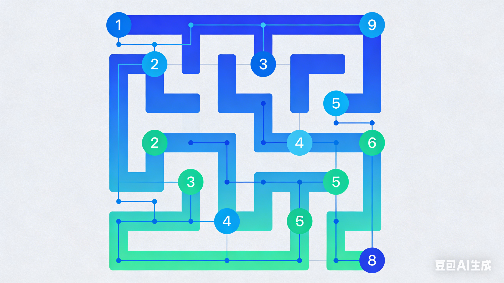

# 算法探索 - Algorithm Visualizer

<div align="center">


一个现代化的算法可视化平台，帮助开发者直观理解算法执行过程

[项目演示](#项目演示) • [快速开始](#快速开始) • [插件开发](#插件开发) • [贡献指南](#贡献指南)

</div>

## ✨ 项目特色

- 🎯 **直观可视化** - 实时展示算法执行步骤
- 🔌 **插件化架构** - 支持算法插件动态加载
- 🎨 **现代化UI** - 响应式设计，美观易用
- 📚 **教育友好** - 适合教学和学习场景
- 🔧 **易于扩展** - 提供完整的插件开发指南

## 📋 项目结构

```
algoShow/
├── plugins/                 # 算法插件目录
│   ├── BubbleSort/         # 冒泡排序插件
│   └── MazeDFS/           # 迷宫DFS插件
├── public/                 # 静态资源
│   ├── css/               # 样式文件
│   ├── js/                # JavaScript文件
│   └── index.html         # 主页面
├── ioc/                   # IOC容器
├── utils/                 # 工具类
├── server.js              # 服务器入口
└── package.json           # 项目配置
```

## 🚀 快速开始

### 环境要求

- Node.js 18.0 或更高版本
- npm 或 yarn 包管理器

### 安装步骤

1. **克隆项目**
```bash
git clone <项目地址>
cd algoShow
```

2. **安装依赖**
```bash
npm install
```

3. **启动服务器**
```bash
# 开发模式
npm run dev

# 生产模式
npm start
```

4. **访问应用**
打开浏览器访问 [http://localhost:3000](http://localhost:3000)

## 📊 内置算法

### 🔢 冒泡排序 (Bubble Sort)
- **分类**: 排序算法
- **复杂度**: O(n²)
- **特点**: 简单直观的排序算法演示

### 🧩 迷宫深度优先搜索 (Maze DFS)
- **分类**: 图算法
- **复杂度**: O(V+E)
- **特点**: 
  - 支持两种迷宫生成算法
  - 实时显示DFS堆栈状态
  - 可调节迷宫大小和复杂度

## 🔌 插件开发

### 插件架构

项目采用插件化设计，每个算法都是一个独立的插件：

```
plugins/
└── AlgorithmName/
    ├── manifest.json      # 插件元数据
    ├── algorithm.js       # 算法实现
    ├── visualization.js   # 可视化逻辑
    ├── style.css         # 插件样式
    ├── index.html        # 插件界面
    └── thumbnail.png     # 插件缩略图
```

### 快速创建插件

1. **创建插件目录**
```bash
mkdir plugins/MyAlgorithm
cd plugins/MyAlgorithm
```

2. **配置manifest.json**
```json
{
  "name": "我的算法",
  "description": "算法描述",
  "version": "1.0.0",
  "author": "开发者",
  "category": "分类",
  "thumbnail": "thumbnail.png",
  "main": "algorithm.js",
  "visualization": "visualization.js",
  "style": "style.css",
  "entry": "index.html"
}
```

3. **实现算法逻辑**（参考开发规范）

详细开发指南请查看：[开发规范.md](./开发规范.md)

## 🛠️ 技术栈

### 后端技术
- **Node.js** - 服务器运行环境
- **Express.js** - Web应用框架
- **IOC容器** - 依赖注入管理

### 前端技术
- **HTML5 Canvas** - 算法可视化
- **现代CSS** - 响应式UI设计
- **原生JavaScript** - 交互逻辑

### 架构设计
- **插件化架构** - 支持动态扩展
- **模块化设计** - 代码组织清晰
- **RESTful API** - 标准接口设计

## 📖 使用指南

### 主界面功能

1. **算法选择** - 点击算法卡片进入对应插件
2. **参数配置** - 调整算法参数和运行条件
3. **可视化控制** - 播放、暂停、步进控制
4. **状态监控** - 实时显示算法执行状态

### 插件界面功能

每个插件都提供以下标准功能：
- **算法描述** - 算法原理和复杂度分析
- **参数设置** - 可配置的运行参数
- **可视化区域** - 算法执行过程展示
- **控制面板** - 播放控制和速度调节
- **步骤信息** - 详细的执行步骤说明

## 🎯 项目演示

### 主界面


### 迷宫DFS插件


## 🔧 开发指南

### 代码规范

- **命名规范**: PascalCase目录、kebab-case文件、camelCase变量
- **代码风格**: 统一的缩进和注释规范
- **模块设计**: 清晰的职责分离

### 插件开发规范

详细规范请参考：[插件开发指南](./PLUGIN_DEVELOPMENT_GUIDE.md)

## 🤝 贡献指南

我们欢迎社区贡献！请遵循以下流程：

### 贡献流程

1. **Fork项目**
2. **创建功能分支** (`git checkout -b feature/AmazingFeature`)
3. **提交更改** (`git commit -m 'Add some AmazingFeature'`)
4. **推送到分支** (`git push origin feature/AmazingFeature`)
5. **创建Pull Request**

### 贡献类型

- 🐛 **Bug修复** - 报告和修复问题
- ✨ **新功能** - 实现新的算法插件
- 📚 **文档改进** - 完善文档和教程
- 🎨 **UI优化** - 改进用户体验
- 🔧 **性能优化** - 提升系统性能

## 📄 许可证

本项目采用 MIT 许可证 - 查看 [LICENSE](LICENSE) 文件了解详情

## 🙏 致谢

感谢所有为这个项目做出贡献的开发者！

## 📞 联系方式

- **项目主页**: [GitHub Repository]
- **问题反馈**: [Issues]
- **讨论区**: [Discussions]

---

<div align="center">

**如果这个项目对你有帮助，请给个⭐️星标支持！**

© 2024 算法探索. All rights reserved.

</div>